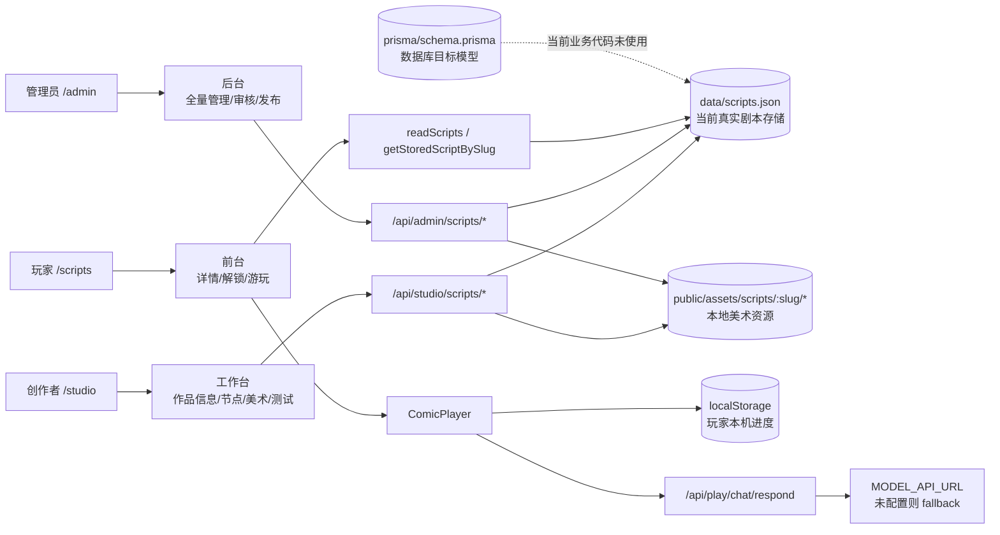
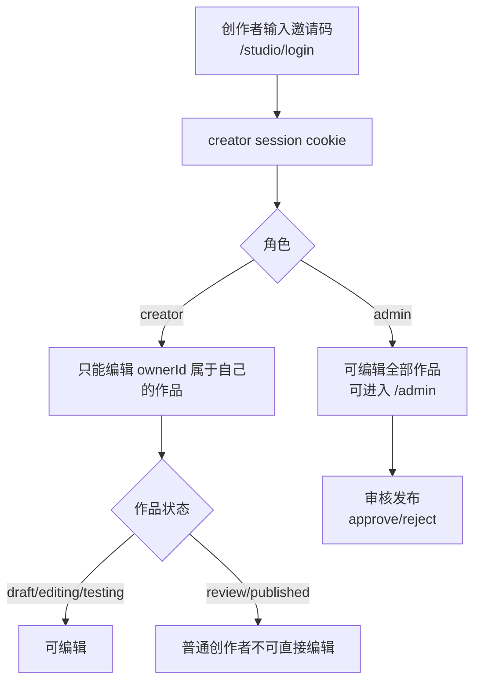
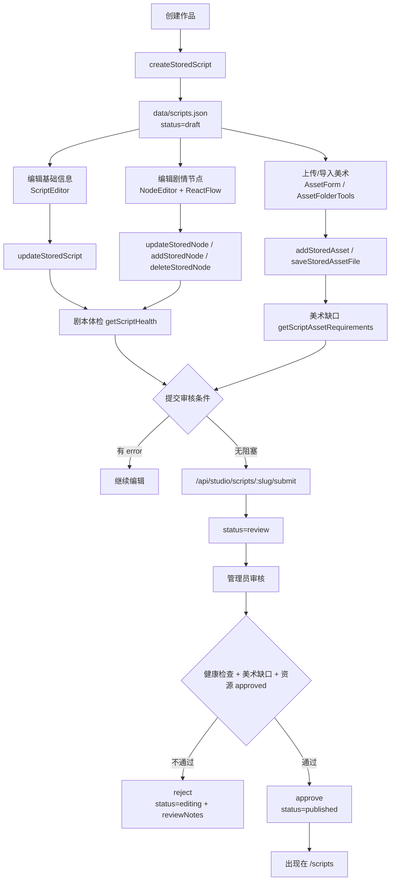
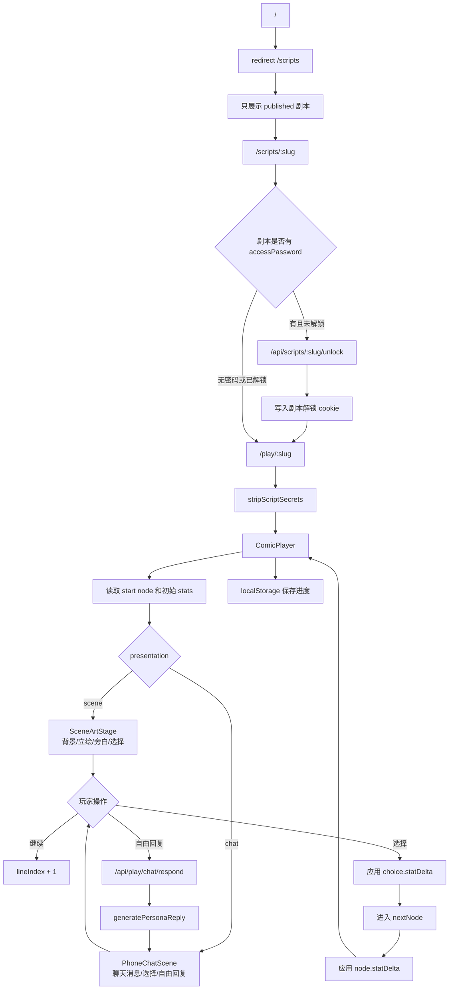
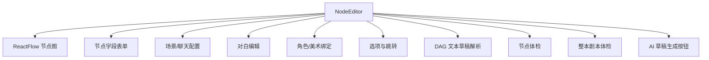

# 当前项目流程与优化路线

本文档记录当前代码里的真实流程，和 `docs/mvp-design.md` 里的目标设计分开看。当前项目已经跑通了“创作/管理 -> 本地文件存储 -> 发布 -> 前台游玩”的 MVP 闭环，但数据库、服务端游玩记录、AI 任务流水线还没有真正接入。

## 1. 当前总览

当前核心事实：

- 剧本主数据读写在 `src/lib/script-store.ts`，落到 `data/scripts.json`。
- 美术上传/导入在 `src/lib/asset-folder-store.ts`，文件落到 `public/assets/scripts/:slug/*`。
- Prisma schema 已经定义得比较完整，但目前没有业务调用 `prisma.*`。
- 前台游玩由 `src/components/play/comic-player.tsx` 在浏览器内推进，进度写入 `localStorage`。
- 自由聊天只在 chat 节点里调用 `/api/play/chat/respond`，再走 `persona-chat` 和可选 `MODEL_API_URL`。

## 2. 角色与权限

当前权限实现集中在：

- `src/lib/creator-auth.ts`
- `src/lib/admin-auth.ts`
- `/api/studio/scripts/*`
- `/api/admin/scripts/*`

## 3. 创作到发布流程

## 4. 玩家游玩流程

当前游玩层缺口：

- 没有服务端 `PlaySession`。
- 没有 `PlayEvent` 记录。
- 结局没有进入服务端统计。
- 玩家刷新/换设备/换浏览器时无法同步进度。

## 5. 后台节点编辑器现状

`src/components/admin/node-editor.tsx` 是当前最重的单文件模块，承担了多种职责：

这让后续维护会越来越吃力。建议拆分为：

- `NodeFlowCanvas`：只负责 ReactFlow 节点和连线。
- `NodeInspector`：节点基础信息、presentation、scene/chat 配置。
- `DialogueEditor`：对白/旁白编辑。
- `ChoiceEditor`：选择、跳转、属性变化。
- `NodeAssetBinder`：背景、角色立绘绑定。
- `ScriptHealthPanel` / `NodeHealthPanel`：复用 `src/lib/script-health.ts` 的结果。
- `DagDraftImportPanel`：DAG 草稿导入。

## 6. 优化路线

### 阶段 A：先稳住 MVP

目标是不改变数据层，只降低维护成本。

1. 已完成：抽离 `node-editor.tsx` 的体检逻辑，统一使用 `src/lib/script-health.ts`。
2. 进行中：拆分 `NodeEditor` 子组件，先不改 UI 和 API。
   - 已完成：拆出 `ScriptHealthPanel` / `NodeHealthPanel` 到 `src/components/admin/node-editor-health-panels.tsx`。
   - 已完成：拆出 `Section` / `PreviewStat` / `Field` 到 `src/components/admin/node-editor-ui.tsx`。
   - 已完成：拆出 `ChoiceEditor` 到 `src/components/admin/node-choice-editor.tsx`。
3. 建立 `src/lib/script-status.ts`，统一状态流转和可编辑判断。
4. 修复明显的编码/文案乱码问题，避免编辑器和审核页文本不可读。
5. 为关键工具函数加最小单元测试：`play-engine`、`script-health`、`dag-draft`。

### 阶段 B：补服务端游玩记录

目标是让产品有数据基础。

1. 新增 `/api/play/sessions` 创建/读取 session。
2. 新增 `/api/play/sessions/:id/choose`，把选择推进放到服务端。
3. 写入 `PlayEvent`，记录进入节点、选择、结局。
4. 前端 `ComicPlayer` 从 localStorage-only 改成 server-first + local fallback。
5. 结局页/结局卡片接入服务端解锁记录。

### 阶段 C：切换 Prisma 数据层

目标是支持多人协作和正式部署。

1. 写 `script-repository` 接口，先让现有 JSON store 实现同一套接口。
2. 写 Prisma repository，把 `DemoScript` 和 Prisma 表结构互相转换。
3. 迁移 `data/scripts.json` 到 SQLite。
4. API 从 `script-store.ts` 切到 repository。
5. 发布前再考虑 PostgreSQL。

### 阶段 D：完善 AI 生产流水线

目标是让 AI 不只是“生成一段草稿”，而是进入可追踪的生产任务。

1. 让 `AiJob` 真正落库或落 store。
2. 任务类型拆成 outline、characters、nodes、asset_plan、node_dialogue、consistency_check。
3. AI 输出先进入待确认状态，不直接覆盖正式内容。
4. 在审核页显示 AI 未确认项。
5. 自动试玩报告基于 `PlayEvent` 或模拟器跑全图。

## 7. 优先级建议

建议先做这个顺序：

1. 先拆 `NodeEditor`，因为它已经是最大维护风险。
2. 再做统一状态机，避免发布和编辑权限散落在多个 route。
3. 再补服务端游玩 session，因为它直接决定后续数据分析和用户留存。
4. 最后切 Prisma。数据库切换很关键，但现在直接切会同时牵动后台、前台、上传、审核，适合等组件和状态逻辑稳一点再动。

如果只选一个最先动手的点：拆 `NodeEditor`，先把体检逻辑删重并组件化。这一刀收益最大，也最不影响产品行为。
